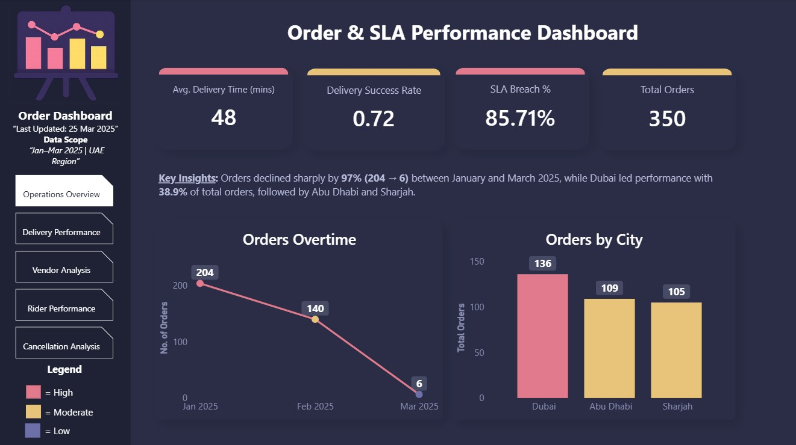
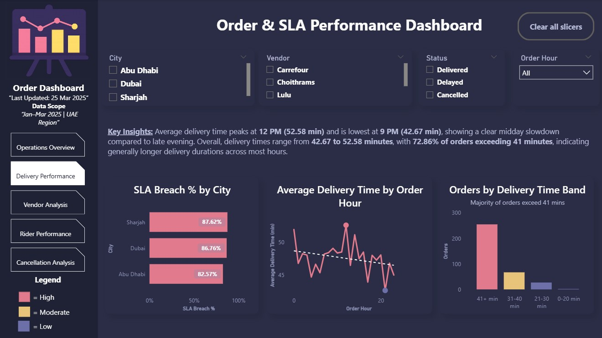
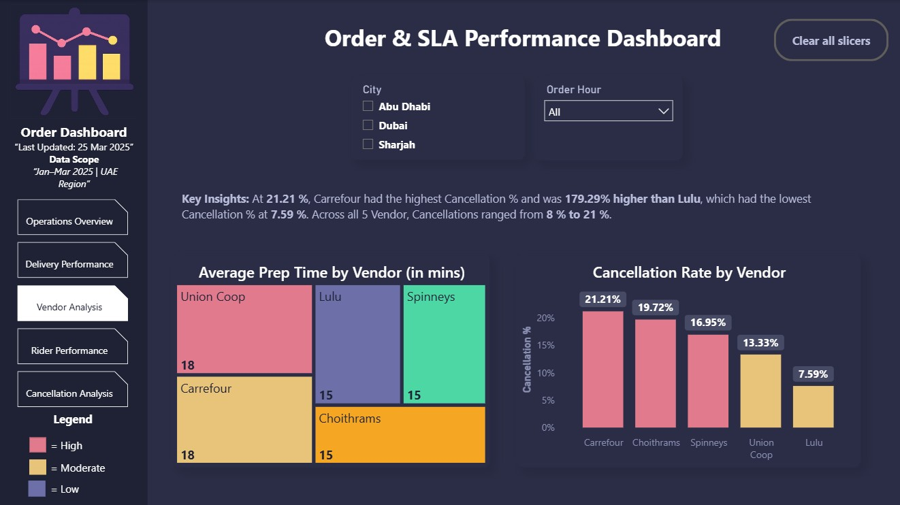
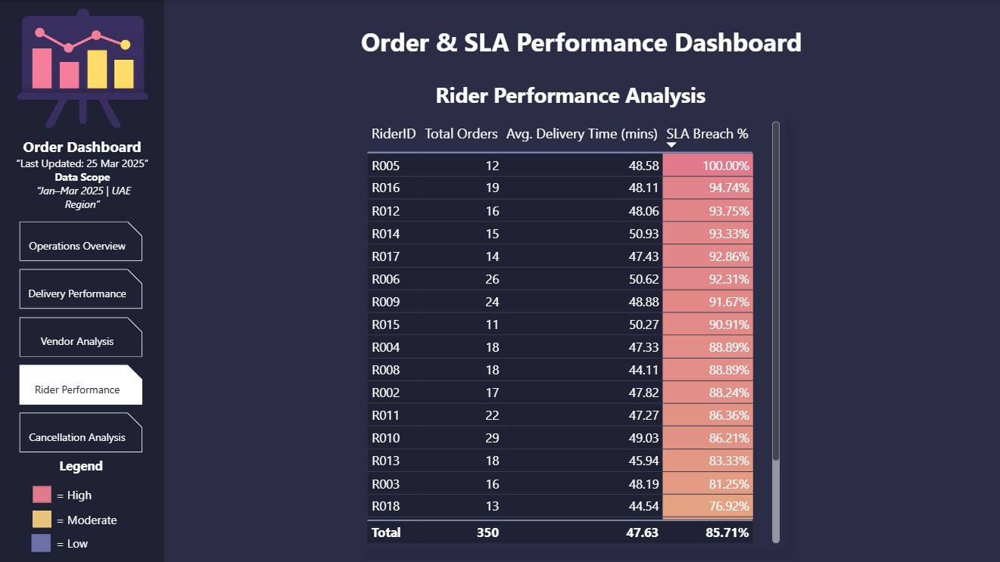
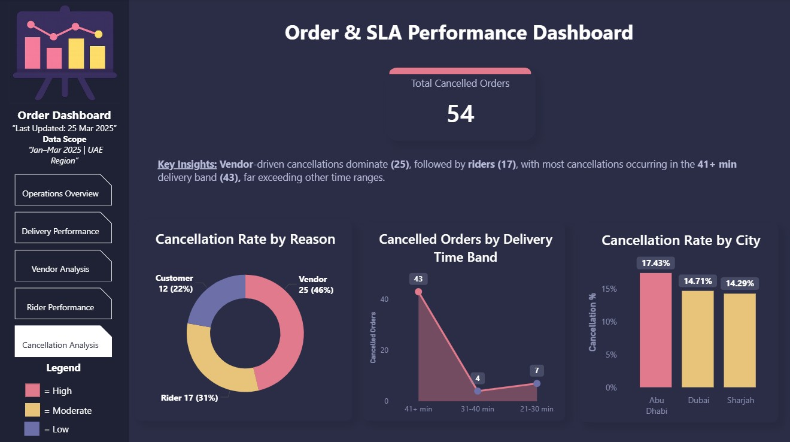

#  Order & SLA Performance Dashboard | Power BI

This is a multi-page Power BI dashboard analyzing delivery operations, SLA performance, and cancellations across UAE cities, vendors, and riders to identify key operational inefficiencies.

---

##  Project Overview
This project simulates a delivery platform’s operations (similar to Talabat) and focuses on analyzing order performance, delivery efficiency, and cancellation patterns.

The dashboard is designed using a **consulting-style structure**, enabling stakeholders to quickly understand operational health, identify bottlenecks, and make data-driven decisions.

---

##  Business Questions Answered
- How is overall delivery performance trending over time?
- Which cities are performing best/worst in terms of SLA compliance?
- When do delivery delays occur during the day?
- Which vendors contribute most to delays and cancellations?
- How do riders perform across key delivery KPIs?
- What are the main drivers behind order cancellations?

---

##  Dashboard Pages

The dashboard is structured into **5 focused pages**, each answering a specific business question and progressing from high-level overview → detailed operational insights.

---

### Operations Overview
Provides a high-level summary of order trends, city performance, and overall SLA metrics.

**Key Insight:**  
Orders declined significantly by **97% (204 → 6)** from January to March 2025, while **Dubai led performance (38.9%)**, followed by Abu Dhabi and Sharjah.

---

### Delivery Performance
Analyzes delivery time trends, SLA breaches, and distribution of delivery durations.

**Key Insight:**  
Average delivery time peaks at **12 PM (52.58 mins)** and is lowest at **9 PM (42.67 mins)**.  
Additionally, **72.86% of orders exceed 41 minutes**, indicating consistent delivery delays across most hours.

---

### Vendor Analysis
Evaluates vendor contribution to delays and cancellations through prep time and cancellation rates.

**Key Insight:**  
**Carrefour** recorded the highest cancellation rate (**21.21%**), which is **179.29% higher than Lulu (7.59%)**, highlighting vendor-driven inefficiencies.

---

### Rider Performance
Assesses rider-level efficiency across total orders, delivery time, and SLA compliance.

This page enables identification of underperforming riders using conditional formatting and comparative KPIs.

---

### Cancellation Analysis
Breaks down cancellation reasons, delivery time impact, and city-level cancellation trends.

**Key Insight:**  
Vendor-driven cancellations dominate (**46%**), followed by riders (**31%**).  
Most cancellations occur in the **41+ minute delivery band (43 orders)**, showing a strong link between delays and cancellations.

---

## Key Findings
- Delivery delays are **consistent and systemic**, with the majority of orders exceeding SLA thresholds.
- **Midday (12 PM)** represents peak inefficiency in delivery operations.
- **Vendor performance is a major Obstacle**, significantly impacting cancellations and delays.
- Longer delivery durations (**41+ mins**) strongly correlate with higher cancellation rates.
- Performance varies across cities, with **Dubai leading overall efficiency**.

---

## Data

### Dataset
The dataset consists of **350 simulated delivery orders** across UAE cities (Dubai, Abu Dhabi, Sharjah), including vendor, rider, and time-based operational data.

### Key Fields
- Order ID  
- City  
- Vendor  
- Rider ID  
- Order Time  
- Delivery Time  
- Expected Delivery Time  
- Status (Delivered / Delayed / Cancelled)  
- Cancellation Reason  

---

### Calculated Columns Added
- **Delivery Delay** = Actual - Expected delivery time  
- **SLA Breach Flag** = Identifies late deliveries  
- **Order Hour** = Extracted from order timestamp  
- **Delivery Time Bands** (e.g., 0–20, 21–30, 41+ mins)

---

### Measures Added (DAX)
- Total Orders  
- Delivery Success Rate  
- SLA Breach %  
- Average Delivery Time  
- Average Delivery Delay  
- Cancellation Rate  
